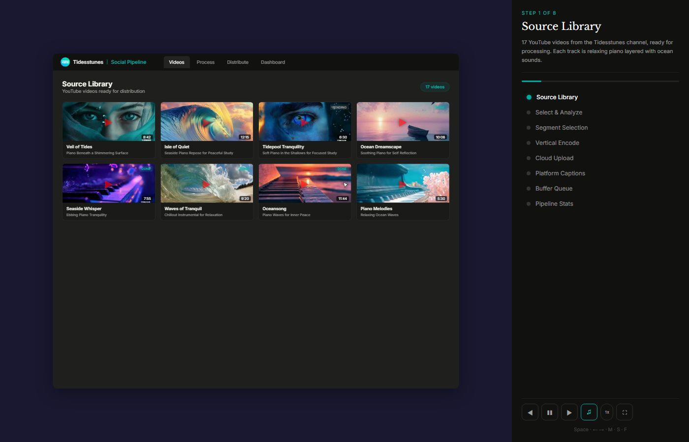
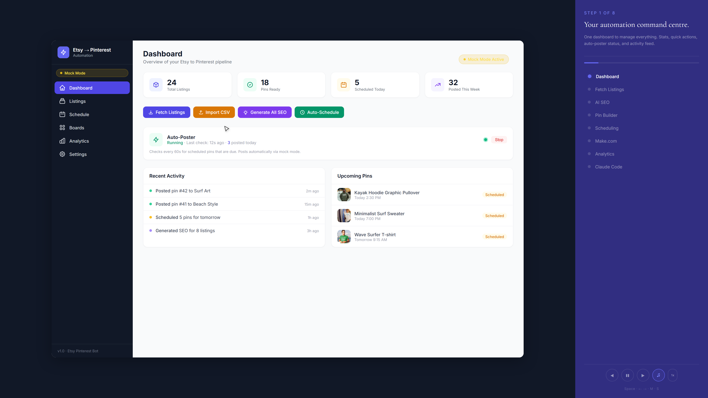
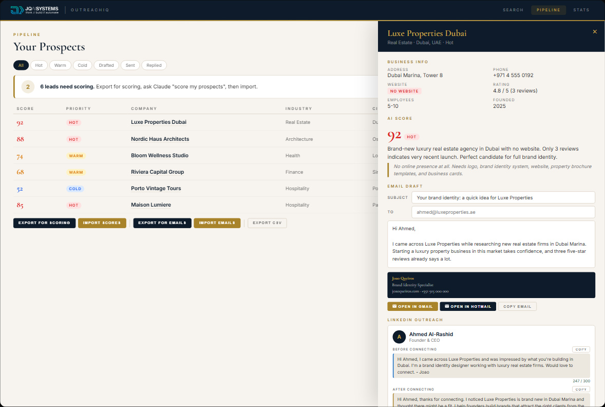
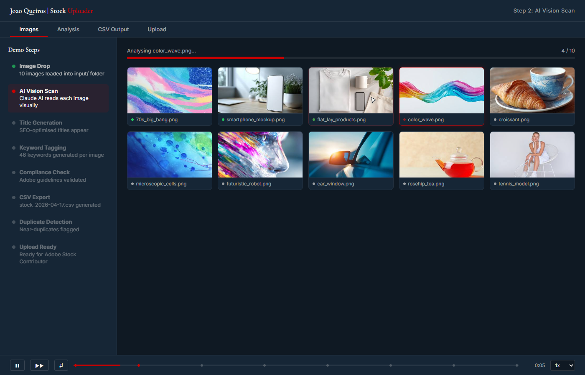

# JQ AI SYSTEMS Public Demos

Screenshots and links for public AI workflow demos hosted on [ai.joaoqueiros.com](https://www.ai.joaoqueiros.com).

This repo intentionally does not include the demo HTML source. It is a public gallery for clients who want to see the workflows in motion.

## Demos

| Demo | Preview | Live Walkthrough |
|---|---|---|
| Tidesstunes Social Pipeline |  | [Open demo](https://www.ai.joaoqueiros.com/demo/tidesstunes-social-pipeline.html) |
| Etsy to Pinterest Pipeline |  | [Open demo](https://www.ai.joaoqueiros.com/demo/etsy-to-pinterest.html) |
| OutreachIQ |  | [Open demo](https://www.ai.joaoqueiros.com/demo/outreach-iq.html) |
| Adobe Stock Uploader |  | [Open demo](https://www.ai.joaoqueiros.com/demo/adobe-stock-uploader.html) |

## What These Demos Show

- Review queues before publishing or sending.
- AI-generated drafts that still keep a human in control.
- Workflow dashboards for repetitive studio operations.
- The kind of system that can start as an internal tool and become a custom client build.

## Not Included

- Demo HTML source files.
- Production source code.
- API keys, tokens, credentials, logs, prompts, databases, or private client data.

Explore the full systems library: [ai.joaoqueiros.com/systems](https://www.ai.joaoqueiros.com/systems)
