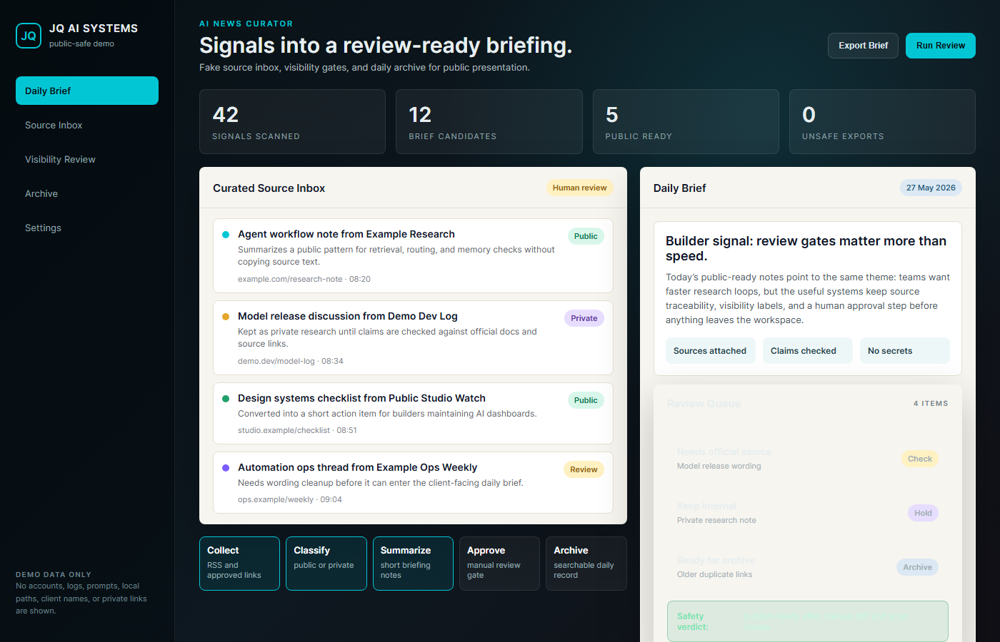
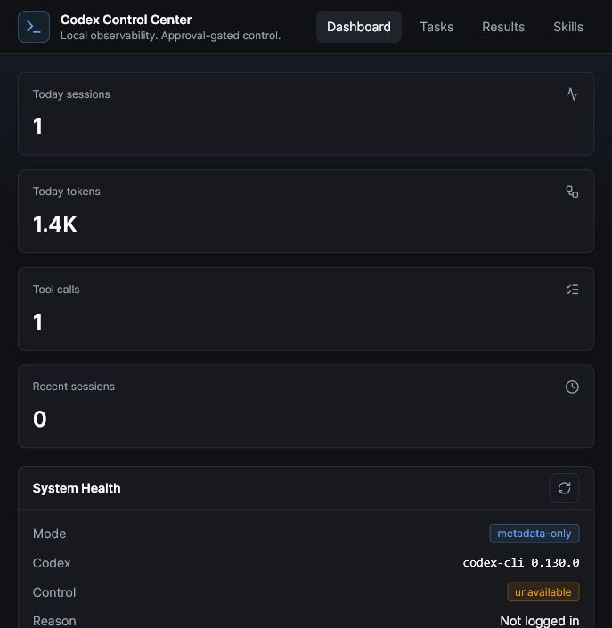

# JQ AI SYSTEMS Public Demos

Screenshots and links for public AI workflow demos hosted on [ai.joaoqueiros.com](https://www.ai.joaoqueiros.com).

This repo is a client-facing gallery. It is here to show how the systems behave: review queues, dashboards, generated drafts, and human approval steps. It intentionally does not include demo HTML source.

## Demos

| Demo | Preview | Live Walkthrough |
|---|---|---|
| Tidesstunes Social Pipeline |  | [Open demo](https://www.ai.joaoqueiros.com/demo/tidesstunes-social-pipeline.html) |
| Etsy to Pinterest Pipeline |  | [Open demo](https://www.ai.joaoqueiros.com/demo/etsy-to-pinterest.html) |
| OutreachIQ |  | [Open demo](https://www.ai.joaoqueiros.com/demo/outreach-iq.html) |
| Adobe Stock Uploader |  | [Open demo](https://www.ai.joaoqueiros.com/demo/adobe-stock-uploader.html) |
| AI News Curator |  | [Open demo](https://www.ai.joaoqueiros.com/demo/ai-news-curator.html) |
| Codex Control Center |  | [Open demo](https://jqaisystems.github.io/codex-control-center/demo/) |

## More Systems (Case Study Only)

These systems do not have a self-playing walkthrough yet. Their public proof lives in the case studies and on the website.

| System | What It Does | Public Proof |
|---|---|---|
| AI Brief Generator | Turns a short intake into a structured creative brief. | [Case study](https://github.com/jqaisystems/jqai-internal-systems/blob/main/case-studies/ai-brief-generator.md) / [Public page](https://www.ai.joaoqueiros.com/systems/ai-brief-generator) |
| Social Media Content Calendar | Builds a month of content from a single brand brief. | [Case study](https://github.com/jqaisystems/jqai-internal-systems/blob/main/case-studies/social-media-content-calendar.md) / [Public page](https://www.ai.joaoqueiros.com/systems/content-calendar) |
| JQ AI Skills | 21 reusable MIT-licensed skills for Codex and Claude Code workflows. | [Repo](https://github.com/jqaisystems/jqai-ai-skills) / [Free downloads](https://www.ai.joaoqueiros.com/skills/) |

## What These Demos Show

- Review queues before publishing or sending.
- AI-generated drafts that still keep a human in control.
- Workflow dashboards for repetitive studio operations.
- Public-safe research briefs, archives, and review gates before sharing.
- The kind of system that can start as an internal tool and become a custom client build.

## How To Use This Repo

Open the live walkthroughs first, then use the screenshots as a quick visual reference. If you want the strategic context behind each demo, read the companion case studies in [`jqai-internal-systems`](https://github.com/jqaisystems/jqai-internal-systems).

## Not Included

- Demo HTML source files.
- Production source code.
- API keys, tokens, credentials, logs, prompts, databases, or private client data.

Explore the full systems library: [ai.joaoqueiros.com/systems](https://www.ai.joaoqueiros.com/systems)

Want a system like this? Start here: [ai.joaoqueiros.com/contact](https://www.ai.joaoqueiros.com/contact)
